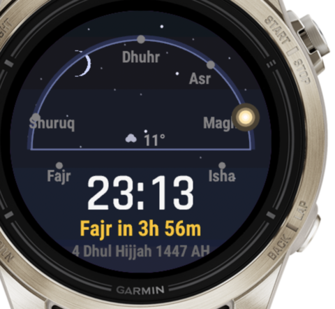
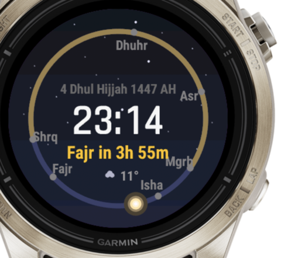
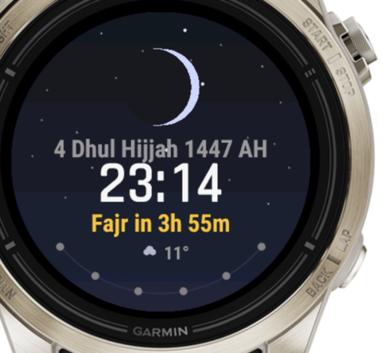

# Garmin Prayer Times Watch Face

A prayer times watch face for Garmin Epix Pro (Gen 2) and compatible AMOLED
devices. Every prayer-time calculation runs on-device using GPS — no internet
required.

## Faces

Four switchable faces, chosen in the Garmin Connect phone app. Each one paints a
living time-of-day sky and shows real-time weather.

| Twilight Horizon | Solar Dial | Crescent Month | Gradient Sky Arc |
|:---:|:---:|:---:|:---:|
|  |  |  |  |

## Features

- **6 daily prayer times** — Fajr, Sunrise, Dhuhr, Asr, Maghrib, Isha
- **Four switchable faces** — Twilight Horizon, Solar Dial, Crescent Month,
  Gradient Sky Arc
- **Living sky** — the background flows continuously with the real time of day:
  dawn warmth, midday light, dusk amber, night with a fading starfield
- **Real-time weather** — temperature and conditions from Garmin's Weather API
- **Approach glow** — a halo builds at the bezel in the last 15 minutes before a
  prayer
- **Live seconds** — a dot fills a ring around the bezel each minute
- **Hijri calendar date** with a moon-phase crescent
- **11 calculation methods** — ISNA, MWL, Egyptian, Umm al-Qura, Dubai, Karachi,
  Kuwait, Qatar, Singapore, Tehran, Turkey
- **Iqama time offsets**, **Asr** Shafi/Hanafi, **Friday/Jumuah** detection
- **AMOLED always-on** — simplified, pure-black low-power mode

## Architecture

```
source/
├── GarminPrayerTimesApp.mc   App entry, GPS
├── GarminPrayerTimesView.mc  Face dispatcher + live seconds
├── PrayerCalculator.mc       Prayer-time math (praytimes.org port)
├── HijriCalendar.mc          Gregorian → Hijri conversion
├── MoonPhase.mc              Lunar phase from the Hijri day
├── PrayerState.mc            State, caching, derived face data
├── Sky.mc                    Continuous time-of-day palette engine
├── WeatherData.mc            Garmin Weather API wrapper
├── Theme.mc                  Shared palette
├── FaceKit.mc                Shared geometry + drawing helpers
└── faces/                    The four watch faces
    ├── HorizonFace.mc
    ├── SolarDialFace.mc
    ├── CrescentFace.mc
    └── GradientArcFace.mc
```

Design and implementation notes live in `docs/superpowers/`.

## Settings (via the Garmin Connect phone app)

| Setting | Default | Description |
|---------|---------|-------------|
| Face Style | Twilight Horizon | Choose one of the four faces |
| Calculation Method | ISNA | Choose from 11 regional methods |
| Asr Method | Shafi | Shafi (standard) or Hanafi |
| Show Iqama | On | Display iqama times |
| Iqama Offsets | Varies | Minutes after adhan per prayer |
| Accent Color | Amber | Highlight colour for the next prayer |

## Building, testing & running

`scripts/dev.sh` wraps the Connect IQ SDK:

```bash
./scripts/dev.sh build      # compile a .prg for the simulator
./scripts/dev.sh test       # compile + run the unit tests
./scripts/dev.sh sim        # load the build into the running simulator
./scripts/dev.sh package    # build the .iq store package
```

Override the target device with `DEVICE=epix2pro47mm ./scripts/dev.sh build`.

> The simulator does not grant GPS to watch faces — the app falls back to a
> default location when no GPS is available. On real hardware, GPS works
> normally.

## Releases & deployment

See [`DEPLOY.md`](DEPLOY.md) for the side-load, Connect IQ Store, and GitHub
Release process. Version history is in [`CHANGELOG.md`](CHANGELOG.md).

Build artifacts (`.prg`, `.iq`) are **not** committed — `bin/` is git-ignored.
They are regenerated with `scripts/dev.sh` and published as GitHub Release
assets.

## Design decisions

- **Watch face** (not widget/app) — always visible, zero navigation
- **On-device calculation** — works offline, no API calls
- **Calculate once per day** — recompute only on date or location change
- **praytimes.org algorithm** — the same math as adhan-swift, battle-tested
